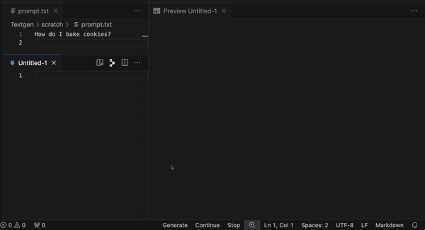

**Note: This repository is a work in progress (WIP) and may not be fully functional yet. Use at your own risk.**

Welcome to the README for the **Dual Pane Brain** extension.



## Introduction

Dual Pane Brain is a WIP dual-pane editor for interacting with openai-compatible Large Language Model (LLM) endpoints. It is designed to provide an effortless way to create new LLM-generated content.

It is developed against `oobabooga` but should work with anything that presents an openai-compatiable api (including openai itself).

## Upcoming features:

- Track open panes properly so we don't break if the user closes the output pane
- "Stop Generation" button to cut off the bot mid sentence
- Various settings toggle buttons somehow

## Changelog

```
0.0.6 - switch from `chunk.message` to `chunk.delta` for openai compat - in both places
0.0.5 - switch from `chunk.message` to `chunk.delta` for openai compat
0.0.4 - add debug param
0.0.3 - actually supply model param to the api call
0.0.2 - write a readme, correct some functionality
0.0.1 - initial release
```

## Setup

To get started with Dual Pane Brain, follow these steps:

1. Install the extension from the [Visual Studio Code Marketplace](https://marketplace.visualstudio.com/items?itemName=thehonker.dualpanebrain).
2. Open your settings.json file in Visual Studio Code.
3. Add the following JSON object inside the `"dpb"` object:

```json
"dpb": {
  "apiUrl": "your_openai_compatiable_endpoint",
  "model": "",
  "sendFullPromptTextOnContinue": false,
  "debug": true
}
```

Replace `"your_openai_compatible_endpoint"` with your preferred openai-compatible endpoint URL (e.g., https://api.openai.com/v1/).

Next, fill in the other settings as per your requirements:

`sendFullPromptTextOnContinue` - Include the full prompt text in `Continue` actions regardless of text selection.

Finally, open the command pallete and search "set api key", selecting the "Dual Pane Brain" entry. This will prompt you for your api key, which is securly stored using vscode magic. Go read the code if you don't trust me, it's very simple.


## Generating
To generate, open a text document in `vscode.ViewColumn.One` (the left hand side).
We'll refer to this editor as the `prompt` pane.

Type up a prompt as desired:

```markdown
How do I bake cookies?
```

Once you have your prompt ready, click the `Generate` button located on the right side of the status bar.

This will send the contents of the prompt pane to the AI API as a `user` message. A new document will open in `vscode.ViewColumn.Two` (response pane), and API responses will be streamed and displayed there:

## Continuing

This is where the magic happens.

The `Continue` button does a few different things based on the selected text in both the prompt and response panes.

When no text is selected in either pane, clicking the `Continue` button takes the contents of the response pane ***before*** the cursor and sends it to the AI API, appending the generated text **after** the cursor.

When text is selected in ***either*** pane, the selected text is sent to the AI API as the prompt. The generated response is inserted ***after*** the cursor.

If `dpb.sendFullPromptTextOnContinue` is `true`, the text in the prompt pane is sent regardless of it being selected or not. This option is handy to toggle on for some workflows. Expect to see a button for it in the future.

## Wrapping up

Contributions are welcome! If you have any ideas or suggestions, please submit an issue or pull request on the GitHub repository.
